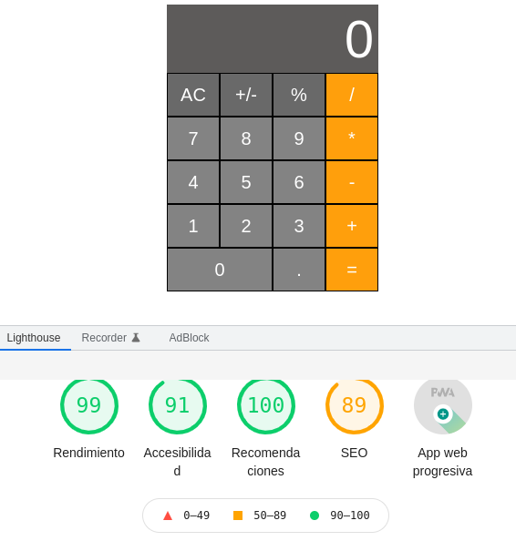

# Calculadora con estilo MacOS realizada en Html, css, javascript, PWA
Realizando un ejercicio tratando de emular la calculadora tipo MacOS en html con ayuda de css y javascript vanilla. 

## Sin funcionalidades en +/- ni %

## Solo operaciones básicas de suma, resta, multiplicacion y division de momento.
